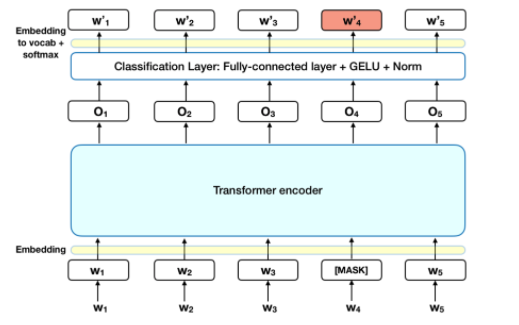
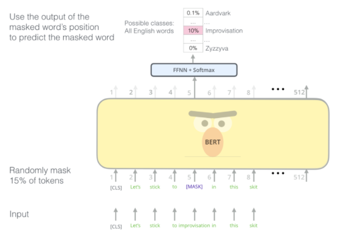
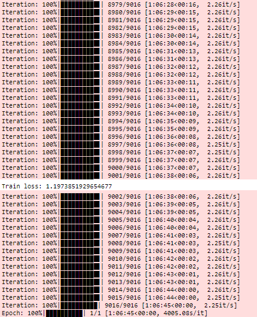
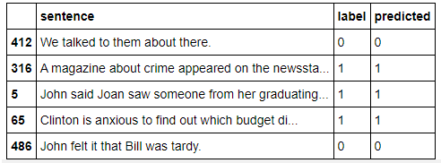
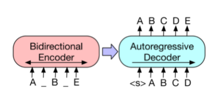
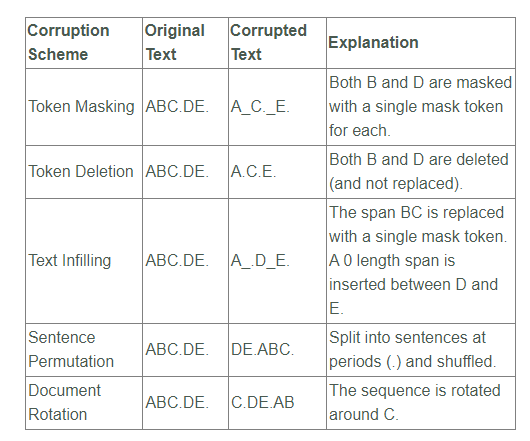

# BERT and BART

> by Krishna N Revi 

## Assignment ❔

1. TASK 1: Train BERT using the code mentioned [here](https://drive.google.com/file/d/1Zp2_Uka8oGDYsSe5ELk-xz6wIX8OIkB7/view?usp=sharing) on the Squad Dataset for 20% overall samples (1/5 Epochs). Show results on 5 samples. 

2. TASK 2: Reproductive [these](https://mccormickml.com/2019/07/22/BERT-fine-tuning/) results, and show output on 5 samples.
3. TASK 3: Reproduce the training explained in this [blog](https://towardsdatascience.com/bart-for-paraphrasing-with-simple-transformers-7c9ea3dfdd8c). You can decide to pick fewer datasets. 
4. Proceed to Session 14 - Assignment Solutions page and:
   1. Submit README link for Task 1 (training log snippets and 5 sample results along with BERT description must be available) - 750
   2. Submit README link for Task 2 (training log snippets and 5 sample results) - 250
   3. Submit README link for Task 3 (training log snippets and 5 sample results along with BART description must be available) - 1000

## Solution 💡

Please refer to complete solution for part 1👉 [here](https://github.com/krishnarevi/TSAI_END2.0_Session14/blob/main/part1_session14_BERT.ipynb)

Please refer to complete solution for part 2 👉 [here](https://github.com/krishnarevi/TSAI_END2.0_Session14/blob/main/partv2_session_14_of_BERT_Fine_Tuning_Sentence_Classification.ipynb)

Please refer to complete solution for part 3 👉 [here](https://github.com/krishnarevi/TSAI_END2.0_Session14/blob/main/part3_session14_BART.ipynb)


### PART 1

#### Task

#### BERT

[BERT ](https://arxiv.org/abs/1810.04805) was released on 11th Oct 2019 by Google. BERT is a Bidirectional Transformer (basically an encode-only ) with a [Masked Language Modelling](https://www.machinecurve.com/index.php/question/what-is-a-masked-language-model-mlm-objective/) and [Next Sentence Prediction](https://www.machinecurve.com/index.php/question/what-is-the-next-sentence-prediction-nsp-language-objective/) task, where the goal is to predict the missing samples. So Given A_C_E, predict B and D.

BERT makes use of Transformer architecture (attention mechanism) that learns contextual relations between words in a text. BERT falls into a self-supervised model category. That means, it can generate inputs and outputs from the raw corpus without being explicitly programmed by humans. Since BERT's goal is to generate a language model, only the encoder mechanism is necessary.

As opposed to directional models, which read the text input sequentially (left to right or right to left), the Transformer encoder reads the entire sequence of words at once. Therefore it is considered bidirectional. This characteristic allows the model to learn the context of a word based on all of its surroundings (left and right of the word).



The diagram above is a high-level Transformer encoder. The input is a sequence of tokens, which are first embedded into vectors and then processed in the neural network. The output is a sequence of vectors, in which each vector corresponds to an input token with the same index.

When training language models, there is a challenge of defining a prediction goal (self-supervision).To overcome this challenge, BERT uses two training strategies.

##### **MASKED LANGUAGE MODEL**

Before feeding word sequence into BERT, 15% of the words in each sequence are replaced with a [MASK] token. The model then attempts to predict the original value of the masked words, based on the context provided by the other, non-masked words in the sequence. In technical terms, the prediction of the output words requires:

1. Adding a classification layer on top of the encoder output
2. Multiplying the output vectors by the embedding matrix, transforming them into the vocabulary dimension.
3. Calculating the probability of each word in the vocabulary with softmax. 

**NEXT SENTENCE PREDICTION**

In the BERT training process, the model receives pairs of sentences as input and learns to predict if the second sentence in the pair *is* the subsequence sentence in the original document. During training, 50% of the inputs are a pair in which the second sentence is the subsequence sentence in the original document, while in the other 50% a random sentence from the corpus is chosen. The assumption is that the random sentence will be disconnected from the first sentence. 

To help the model distinguish between the two sentences in training, the input is processed in the following way before entering the model:

1. A [CLS] token is inserted at the beginning of the first sentence and a [SEP] token is inserted at the end of each sentence. 
2. A sentence embedding indicating Sentence A or Sentence B is added to each token. Sentence embeddings are similar in concept to token embedding with a vocabulary of 2. 
3. A positional embedding is added to each token to indicate its position in the sequence.

 To predict the second sentence is indeed connected to the first, the following steps are performed:

1. The entire input sequence goes through the transformer
2. The output of the [CLS] token is transformed into a 2x1 shaped vector, using a simple classification layer (learned matrices of weights and biases).
3. Calculating the probability of IsNextSequence with SoftMax



While training the BERT model, Masked LM and NSP are trained together, with the goal of maximizing the combined loss function of the two strategies. 

The BERT loss function takes into consideration only the prediction of the masked values and ignores the prediction of the non-masked words (this makes solving this problem even harder as we have reduced the supervision further). As a consequence, the model converges slower than directional models, a characteristic that is offset by its increased context-awareness. 

#### Training Logs



#### Training loss


#### Sample Results


### PART 2

#### Task

Use BERT  to quickly and efficiently fine-tune a model to get near state of the art performance in sentence classification.

We will use BERT to train a text classifier. Specifically, we will take the pre-trained BERT model, add an untrained layer of neurons on the end, and train the new model for our classification task. 

#### Advantages of Fine-Tuning

1. **Quicker Development**
   - First, the pre-trained BERT model weights already encode a lot of information about our language. As a result, it takes much less time to train our fine-tuned model - it is as if we have already trained the bottom layers of our network extensively and only need to gently tune them while using their output as features for our classification task. In fact, the authors recommend only 2-4 epochs of training for fine-tuning BERT on a specific NLP task (compared to the hundreds of GPU hours needed to train the original BERT model or a LSTM from scratch!).
2. **Less Data**
   - In addition and perhaps just as important, because of the pre-trained weights this method allows us to fine-tune our task on a much smaller dataset than would be required in a model that is built from scratch. A major drawback of NLP models built from scratch is that we often need a prohibitively large dataset in order to train our network to reasonable accuracy, meaning a lot of time and energy had to be put into dataset creation. By fine-tuning BERT, we are now able to get away with training a model to good performance on a much smaller amount of training data.
3. **Better Results**
   - Finally, this simple fine-tuning procedure (typically adding one fully-connected layer on top of BERT and training for a few epochs) was shown to achieve state of the art results with minimal task-specific adjustments for a wide variety of tasks: classification, language inference, semantic similarity, question answering, etc. Rather than implementing custom and sometimes-obscure architectures shown to work well on a specific task, simply fine-tuning BERT is shown to be a better (or at least equal) alternative.

#### Training Logs


#### Sample Results




### PART 3

#### Task

Paraphrasing is the act of expressing something using different words while retaining the original meaning. Let’s see how we can do it with BART, a Sequence-to-Sequence Transformer Model.

Due to time and resource constraints we trained our model for only on [Google PAWS-labeled wiki dataset](https://github.com/google-research-datasets/paws#paws-wiki) for one epoch .

#### BART

*BART is a denoising autoencoder for pretraining sequence-to-sequence models. BART is trained by corrupting text with an arbitrary noising function, and  learning a model to reconstruct the original text.*

BART is a denoising autoencoder that maps a corrupted document to the original document it was derived from. [BART ](https://arxiv.org/abs/1910.13461) was released by Facebook on 29th Oct 2019.  It is implemented as a sequence-to-sequence model with a bidirectional encoder over corrupted text and a left-to-right autoregressive decoder. For pre-training, we optimize the negative log likelihood of the original document. BART uses a standard Tranformer-based neural machine translation architecture which, despite its simplicity, can be seen as generalizing BERT (due to the bidirectional encoder), GPT (with the left-to-right decoder), and many other more recent pretraining schemes. 

BART can be fine-tuned to have impressive performances over various tasks like sequence classification (final decoder output connected to a classifier), Sequence Generation (for summarization or question-answering tasks), Machine translation, etc. BART has both an encoder (like BERT) and a decoder (like GPT), essentially getting the best of both worlds. The encoder is a denoising objective similar to BERT while the decoder attempts to reproduce the original sequence (autoencoder), token by token, using the previous (uncorrupted) tokens and the output from the encoder. A significant advantage of this setup is the unlimited flexibility of choosing the corrupting scheme; including changing the length of the original input. 



The corruption schemes used in the paper are summarized below:



The authors of BART paper note that training BART with **text infilling** yields the most consistently strong performance across many tasks.

BART is particularly effective when fine tuned for text generation but also works well for comprehension tasks. It matches the performance of RoBERTa with comparable training resources on GLUE and SQuAD, achieves new state of-the-art results on a range of abstractive dialogue, question answering, and summarization tasks, with gains of up to 6 ROUGE. BART also provides a 1.1 BLEU increase over a back-translation system for machine translation, with only target language pretraining. BART with 406M parameters is very close to T5 with 11B parameters in the summarization task. 

#### Training Logs


#### Sample Results

```
Enter text to paraphrase: A recording of folk songs done for the Columbia society in 1942 was largely arranged by Pjetër Dungu.
Generating outputs:   0%|          | 0/1 [00:00<?, ?it/s]
Original
A recording of folk songs done for the Columbia society in 1942 was largely arranged by Pjetër Dungu.

Predictions >>>
A 1942 recording of folk songs for the Columbia Society was largely arranged by Pjetër Dungu.
A 1942 recording of folk songs for the Columbia Society was largely arranged by Pjetër Dungu.
A 1942 recording of folk songs for the Columbia Society was largely arranged by Pjetër Dungu.
---------------------------------------------------------

Enter text to paraphrase: In mathematical astronomy, his fame is due to the introduction of the astronomical globe, and his early contributions to understanding the movement of the planets.
Generating outputs:   0%|          | 0/1 [00:00<?, ?it/s]
Original
In mathematical astronomy, his fame is due to the introduction of the astronomical globe, and his early contributions to understanding the movement of the planets.

Predictions >>>
In mathematical astronomy, his fame is due to the introduction of the astronomical globe and his early contributions to understanding the movement of the planets.
In mathematical astronomy, his fame is due to the introduction of the astronomical globe and his early contributions to understanding the movement of the planets.
In mathematical astronomy, his fame is due to the introduction of the astronomical globe and his early contributions to understanding the movement of the planets.
---------------------------------------------------------

Enter text to paraphrase: Why are people obsessed with Cara Delevingne?
Generating outputs:   0%|          | 0/1 [00:00<?, ?it/s]
Original
Why are people obsessed with Cara Delevingne?

Predictions >>>
Why are people obsessed with Cara Delevingne?
Why are people obsessed with Cara Delevingne?
Why are people obsessed with Cara Delevingne?
---------------------------------------------------------

Enter text to paraphrase: Earl St Vincent was a British ship that was captured in 1803 and became a French trade man.
Generating outputs:   0%|          | 0/1 [00:00<?, ?it/s]
Original
Earl St Vincent was a British ship that was captured in 1803 and became a French trade man.

Predictions >>>
Earl St Vincent was a British ship captured in 1803 and became a French merchantman.
Earl St Vincent was a British ship captured in 1803 and became a French merchantman.
Earl St Vincent was a British ship that was captured in 1803 and became a French merchantman.
---------------------------------------------------------

Enter text to paraphrase: Worcester is a town and county city of Worcestershire in England.
Generating outputs:   0%|          | 0/1 [00:00<?, ?it/s]
Original
Worcester is a town and county city of Worcestershire in England.

Predictions >>>
Worcester is a town and county town in Worcestershire, England.
Worcester is a town and county town in Worcestershire, England.
Worcester is a town and county town in Worcestershire, England.
---------------------------------------------------------
```

.


