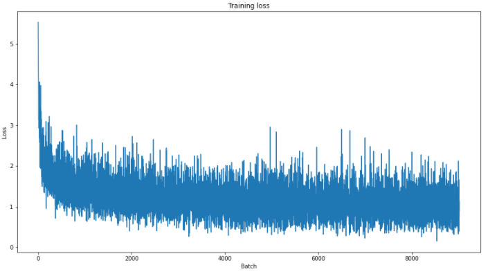
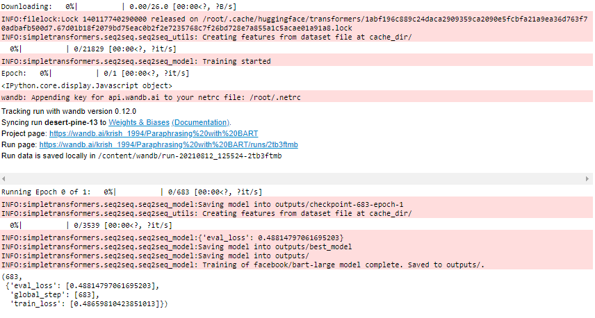

# BERT and BART

> by Krishna N Revi 

## Assignment ❔

1. TASK 1: Train BERT using the code mentioned [here](https://drive.google.com/file/d/1Zp2_Uka8oGDYsSe5ELk-xz6wIX8OIkB7/view?usp=sharing) on the Squad Dataset for 20% overall samples (1/5 Epochs). Show results on 5 samples. 

2. TASK 2: Reproductive [these](https://mccormickml.com/2019/07/22/BERT-fine-tuning/) results, and show output on 5 samples.
3. TASK 3: Reproduce the training explained in this [blog](https://towardsdatascience.com/bart-for-paraphrasing-with-simple-transformers-7c9ea3dfdd8c). You can decide to pick fewer datasets. 
4. Proceed to Session 14 - Assignment Solutions page and:
   1. Submit README link for Task 1 (training log snippets and 5 sample results along with BERT description must be available) - 750
   2. Submit README link for Task 2 (training log snippets and 5 sample results) - 250
   3. Submit README link for Task 3 (training log snippets and 5 sample results along with BART description must be available) - 1000

## Solution 💡

Please refer to complete solution for part 1👉 [here](https://github.com/krishnarevi/TSAI_END2.0_Session14/blob/main/part1_session14_BERT.ipynb)

Please refer to complete solution for part 2 👉 [here](https://github.com/krishnarevi/TSAI_END2.0_Session14/blob/main/partv2_session_14_of_BERT_Fine_Tuning_Sentence_Classification.ipynb)

Please refer to complete solution for part 3 👉 [here](https://github.com/krishnarevi/TSAI_END2.0_Session14/blob/main/part3_session14_BART.ipynb)


#### PART 1

##### Task

##### BERT

##### Training Logs


##### Training loss



##### Sample Results


#### PART 2

##### Task

##### Training Logs


##### Sample Results


#### PART 3

##### Task

##### BART

##### Training Logs




##### Sample Results

```
Enter text to paraphrase: In mathematical astronomy, his fame is due to the introduction of the astronomical globe, and his early contributions to understanding the movement of the planets.
Generating outputs:   0%|          | 0/1 [00:00<?, ?it/s]
Original
In mathematical astronomy, his fame is due to the introduction of the astronomical globe, and his early contributions to understanding the movement of the planets.

Predictions >>>
In mathematical astronomy, his fame is due to the introduction of the astronomical globe and his early contributions to understanding the movement of the planets.
In mathematical astronomy, his fame is due to the introduction of the astronomical globe and his early contributions to understanding the movement of the planets.
In mathematical astronomy, his fame is due to the introduction of the astronomical globe and his early contributions to understanding the movement of the planets.
---------------------------------------------------------

Enter text to paraphrase: Why are people obsessed with Cara Delevingne?
Generating outputs:   0%|          | 0/1 [00:00<?, ?it/s]
Original
Why are people obsessed with Cara Delevingne?

Predictions >>>
Why are people obsessed with Cara Delevingne?
Why are people obsessed with Cara Delevingne?
Why are people obsessed with Cara Delevingne?
---------------------------------------------------------

Enter text to paraphrase: Earl St Vincent was a British ship that was captured in 1803 and became a French trade man.
Generating outputs:   0%|          | 0/1 [00:00<?, ?it/s]
Original
Earl St Vincent was a British ship that was captured in 1803 and became a French trade man.

Predictions >>>
Earl St Vincent was a British ship captured in 1803 and became a French trade man.
Earl St Vincent was a British ship captured in 1803 and became a French trade man.
Earl St Vincent was a British ship that was captured in 1803 and became a French trade man.
---------------------------------------------------------

Enter text to paraphrase: Worcester is a town and county city of Worcestershire in England.
Generating outputs:   0%|          | 0/1 [00:00<?, ?it/s]
Original
Worcester is a town and county city of Worcestershire in England.

Predictions >>>
Worcester is a town and county city of Worcestershire in England.
Worcester is a town and county city of Worcestershire in England.
Worcester is a town and county city of Worcestershire in England.
---------------------------------------------------------

Enter text to paraphrase: The goal of any Deep Learning model is to take in an input and generate the correct output.
Generating outputs:   0%|          | 0/1 [00:00<?, ?it/s]
Original
The goal of any Deep Learning model is to take in an input and generate the correct output.

Predictions >>>
The goal of any deep learning model is to take in an input and generate the correct output.
The goal of any deep learning model is to take in an input and generate the correct output.
The goal of any deep learning model is to take in an input and generate the correct output.
---------------------------------------------------------

Enter text to paraphrase: A recording of folk songs done for the Columbia society in 1942 was largely arranged by Pjetër Dungu.
Generating outputs:   0%|          | 0/1 [00:00<?, ?it/s]
Original
A recording of folk songs done for the Columbia society in 1942 was largely arranged by Pjetër Dungu.

Predictions >>>
A recording of folk songs done for the Columbia Society in 1942 was largely arranged by Pjetër Dungu.
A recording of folk songs done for the Columbia Society in 1942 was largely arranged by Pjetër Dungu.
A recording of folk songs done for the Columbia Society in 1942 was largely arranged by Pjetër Dungu.
---------------------------------------------------------
```


